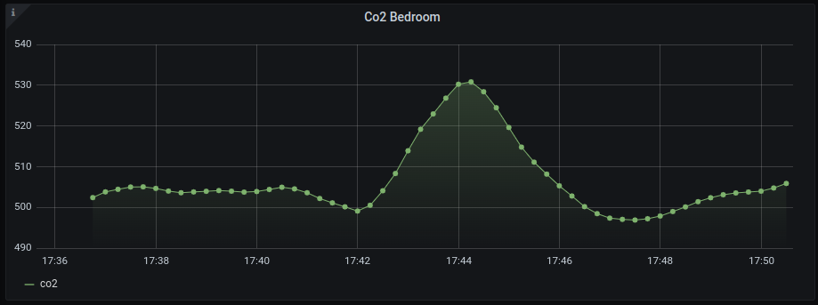

# Flink Home

# Table of Contents
- [Description](#description)
- [Components](#components)
- [Setup](#setup)
    - [Assumptions](#assumptions)
    - [Pi Pico](#pi-pico)
    - [Kubernetes](#kubernetes)
       - [MQTT](#mqtt)
       - [InfluxDB](#influxdb)
       - [Apache Flink](#apache-flink)
       - [Bento](#bento)
    - [Case](#case)

### Description

Flink home is a scala streaming application run on my at home raspberry-pi cluster. The aim of flink home is to ingest data from various CO2 sensor nodes in my home (powered via the Pi Pico W), clean the data, and sink it to InfluxDB which can be used as a source in grafana. 

The data from this will then be used to automate the fan speed of my home ventilation system once the CO2 levels in a particular room reach a certain pre-defined threshold. We will do this using a custom made client - [Bento](https://github.com/Cian911/bento).

There will be an accompanying blog post for this project added here in the very near future.

  

### Components

The components I'm using in this project are as follows. All of these can be found quite easily online for purchase. I've also added optionally the single room heat recovery unti I used for ventilation in my home. While this is not necessary, I myself use data from the CO2 sensor to automate & control the fan speed in any given room in my home.

- [RPI SHD CO2 Sensor (Raspberry Pi CO2 Sensor Breakout board)](https://www.reichelt.com/pl/en/raspberry-pi-shield-co2-sensor-breakout-board-rpi-shd-co2-sens-p311516.html?r=1)
- [I2C OLED Display](https://randomnerdtutorials.com/guide-for-oled-display-with-arduino/)
- [Double Sided PCB Boards](https://www.amazon.co.uk/gp/product/B073ZHVKC1/ref=ppx_yo_dt_b_asin_title_o05_s00?ie=UTF8&psc=1)
- [Single Room Heat Recovery Unit](https://www.blauberg.co.uk/en/blauberg-mini-air-decentralised-heat-recovery-unit-single-wall-mounted-d-mvhr-ventilator-smart-wifi-control)

### Setup

#### Assumptions

In my particular case, I had some things running out of the box for this project already such as Grafana and and existing MQTT broker all running within my at home K8s cluster running a couple of raspberry-pis as example.

Going forward, this project assumes you can fill in the holes which I may have left out, or modify & taylor anything in this project to suite your own needs.

#### Pi Pico

Code and documentation pertaining to the setup on the Raspberry Pi Pico can be found [here](./pi-pico/README.md).

#### Kubernetes
All things K8s

##### MQTT
MQTT Stuff

##### InfluxDB
InfluxDB stuff

##### Apache Flink
Flink stuff

##### Bento
Vento bento hento stuff for vents

#### Case

Link off to STL files for printing sensor hosuing.
