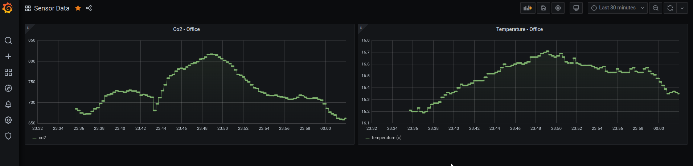

# Flink Home

### Description

Flink home is a scala streaming application run on my at home raspberry-pi cluster. The aim of flink home is to ingest data from various CO2 sensor nodes in my home (powered via the Pi Pico W), aggregate it, and sink it to InfluxDB which can be used as a source in grafana.

  

