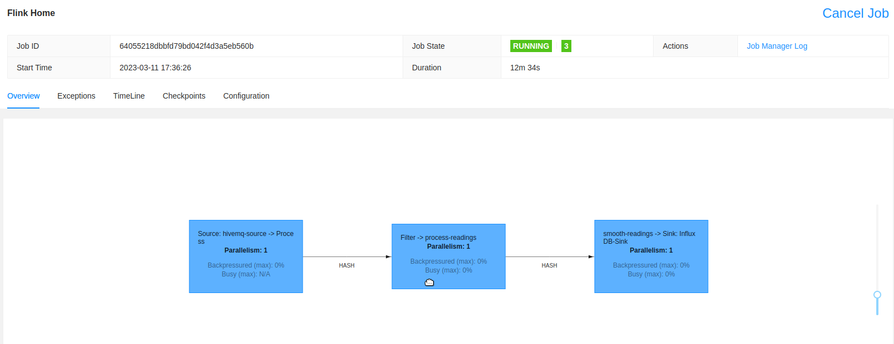

# Flink Home

### Description

Flink home is a scala streaming application run on my at home raspberry-pi cluster. The aim of flink home is to ingest data from various CO2 sensor nodes in my home (powered via the Pi Pico W), clean the data, and sink it to InfluxDB which can be used as a source in grafana.

<p align="center">
  
</p>


### Schema

```json
event = {
  "event": {
    "co2": 500,
    "temperature": 21.0,
    "pressure": 900,
    "node_id": 1,
    "timestamp": 1673213606
  }
}
```
### Build & Run

Run the following:

```scala
sbt compile
sbt proguard
```

This will build a JAR file in the following path: `./target/scala-2.12/proguard/flink-home_2.12-0.1-SNAPSHOT.jar`

You can then run and upload the job via the Flink UI and start the job.


