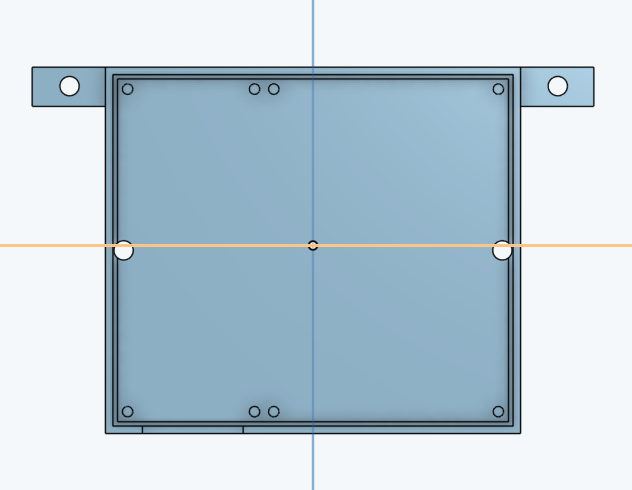
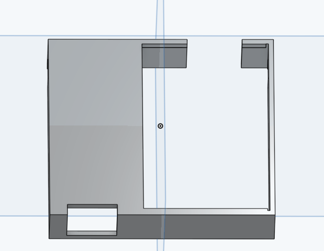

# CO2 Sensor Casing

Included in this folder are two `STL` files which you can use to 3D print a hosuing for the sensor and LED screen. One for the bottom casing for the sensor, and one for the top.

I am by no means an expert in 3D design, but this is the best I came up with (which I'm pretty happy with TBH).

 
